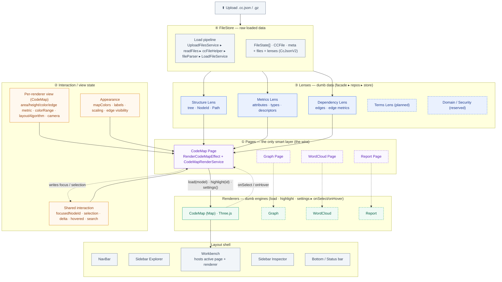
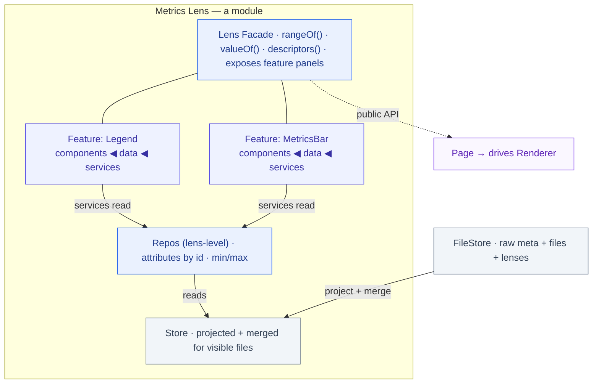
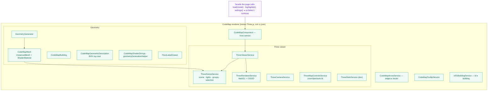
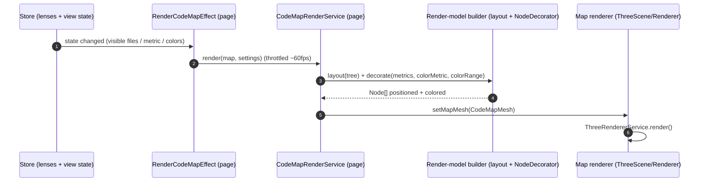
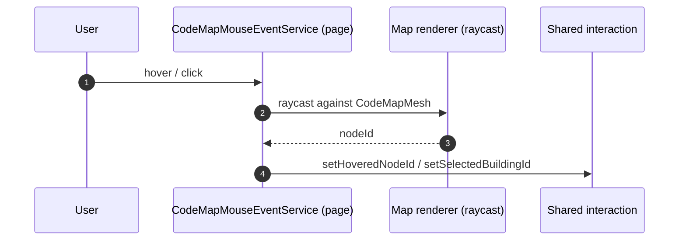
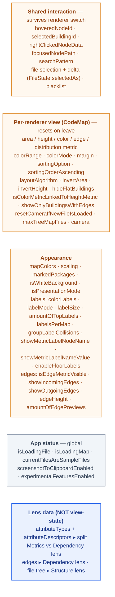
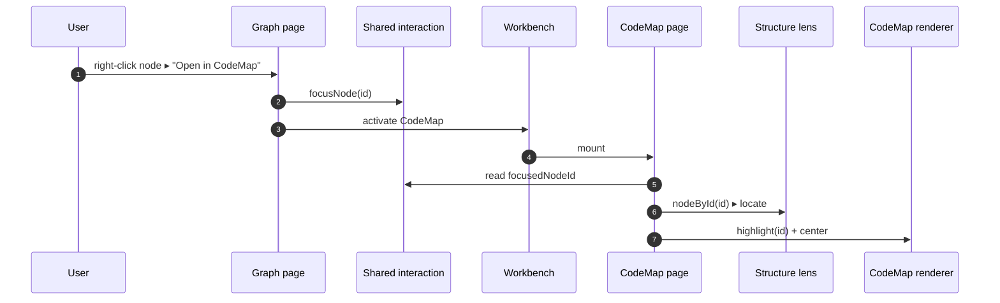

# CodeCharta 2.0 — Goal Architecture (mermaid)

> **Draft / target picture — for discussion.** Diagrams are grounded in the *real* codebase
> (actual class, service, slice and model-field names), classified into the goal boxes we agreed on.
>
> **One sentence:** a file is uploaded into a raw **FileStore**; each **lens** projects one data
> signal; a **page** reads the lenses it needs plus the current view state, turns them into a
> **render-model**, and drives a **dumb renderer** through a tiny facade (`load · highlight ·
> settings`) — routing the renderer's events back into shared state. *Nothing but the page knows
> more than one thing.*
>
> Colour key: 🟦 lens (data) · 🟩 renderer (dumb engine) · 🟪 page (the wire) · 🟧 interaction/view-state · ⬜ infra (file store / shell).
> View on GitHub, in VS Code (Markdown Preview Mermaid), or at mermaid.live.

---

## 1 · The full system

---

## 2 · Ingest → FileStore (real load pipeline)

```mermaid
flowchart LR
  A["NavBar folder button"]:::infra --> B["UploadFilesService.uploadFiles()"]:::infra
  B --> C["readFiles()<br/>FileReader + gzip (pako)"]:::infra
  C --> D["getCCFileAndDecorateFileChecksum()<br/>JSON.parse + md5"]:::infra
  D --> E["LoadFileService.loadFiles()"]:::infra
  E --> F["enrichFileStatesAndRecentFiles…()<br/>checkErrors · checkWarnings · removeAuthorsAttributes"]:::infra
  F --> G["getCCFile() ▸ CCFile<br/>NodeDecorator.decorateMapWithPathAttribute"]:::infra
  G --> H["LoadFileStore.setFiles / setStandardByNames"]:::infra
  H --> I["files reducer ▸ FileState[]<br/>(this is the FileStore)"]:::infra
  classDef infra fill:#f1f5f9,stroke:#64748b,color:#334155;
```

---

## 3 · Lens anatomy — features inside (facade ▸ features ▸ repos ▸ store)

A lens is a **module**: a Lens Facade + several **Features** + lens-level **Repos** + a **Store**. Each
feature = `facade · models · components · services`, where **components take data from services** and
**services read the repo**. (Metrics lens shown expanded; Structure & Dependency follow the same shape.)

> Real fields per lens (the Store contents): **Structure** = `Node(name,type,children,link)` ·
> `NodeId(sha256 path)` · `Path` · `NodeType`. **Metrics** = `attributes` · `attributeTypes(ABSOLUTE/RELATIVE)`
> · `attributeDescriptors` · `clusters`. **Dependency** = `Edge(fromId,toId,attributes)` · edge types/descriptors.
> Each lens's features differ (Structure: Explorer/Search/ContextMenu · Dependency: EdgeSettings/Graph-ctrls).

---

## 4 · Inside the CodeMap (Map) renderer — the dumb engine

---

## 5 · The render cycle (page = the wire)

---

## 6 · Where the real ngrx slices go (interaction / view-state split)

> Decisions encoded above: `blacklist` and `markedPackages` are **view concerns**, not lens data
> (a user filter / highlight, not a signal from the file). `attributeTypes` / `attributeDescriptors`
> **split** — node metrics ▸ Metrics lens, edge metrics ▸ Dependency lens.

---

## 7 · Cross-renderer jump (why shared interaction must exist)

> The `id` is the cc.json 2.0 node id (sha-256 of canonical path, 16 hex). The same id keys the
> structure tree, the metrics, and the edge endpoints — so it joins lenses **and** resolves in any
> renderer. This is what makes the jump possible.

---

## 8 · Today → goal (it already exists, just renamed)

| Today (real code) | Goal box |
|---|---|
| `CodeMapRenderService`, `ThreeSceneService`/`ThreeViewerService`/`ThreeRendererService`, `GeometryGenerator`, `CodeMapMesh`, `CodeMapBuilding`, `CodeMapGeometricDescription`, shaders, `FloorLabelDrawer` | **Renderer** (Map engine) + render-model builder |
| `RenderCodeMapEffect`, `CodeMapComponent`, `CodeMapMouseEventService`, `CodeMapArrowService`, `CodeMapTooltipService`, `IdToBuildingService` | **CodeMap Page** (the wire) |
| 99 `*Store` facades + `state/store` selectors | **Lens facades** (one per lens) + small view stores |
| `fileSettings.attributeTypes` / `attributeDescriptors` | **Metrics** + **Dependency** lens (split) |
| `fileSettings.edges` | **Dependency** lens |
| `dynamicSettings.*` (area/height/color/edge metric, colorRange, margin, layoutAlgorithm…) | **Per-renderer view state** |
| `appSettings.mapColors` / labels / scaling / edge visibility | **Appearance** |
| `appStatus.*` + `files[].selectedAs` + `focusedNodePath` + `searchPattern` + `blacklist` | **Shared interaction** |
| `UploadFilesService` ▸ `readFiles` ▸ `ccFileHelper` ▸ `fileParser` ▸ `LoadFileService` ▸ `LoadFileStore` ▸ `files` reducer | **FileStore** + load pipeline |
| analysis `Project` / `CcJsonV2` (`meta`, `files`, `lenses`: `MetricsLens`/`DependencyLens`/opaque) | the cc.json 2.0 contract the lenses mirror |

---

*Companion to `Ideas/image.png`, `Ideas/codecharta-2.0-architecture.html`, and
`Ideas/codecharta-2.0-goal-architecture.html`. Generated from a live inventory of the repo — names
reflect current code; the box assignment is the proposed target. Not final.*
