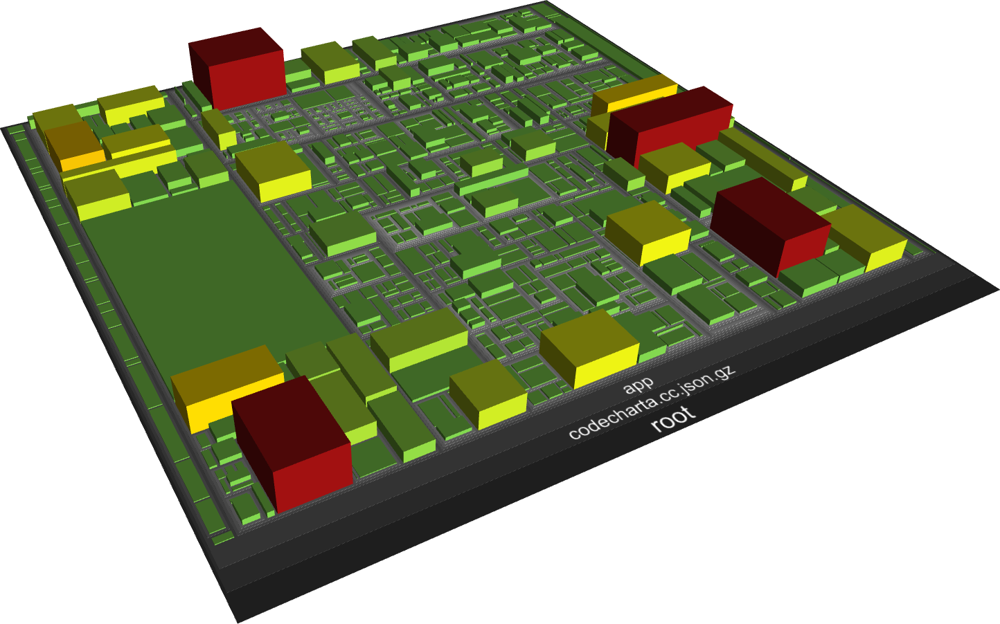

# CodeCharta

[](https://travis-ci.org/MaibornWolff/codecharta)
[](https://sonarcloud.io/dashboard?id=de.maibornwolff.codecharta%3Aanalysis)
[](https://sonarcloud.io/dashboard?id=de.maibornwolff.codecharta%3Avisualization)

> CodeCharta by [MaibornWolff](https://www.maibornwolff.de)

## What is CodeCharta

CodeCharta is a beautiful tool to help you visualize and understand code. It can combine code metrics from multiple sources and visualize them using 3D tree maps. CodeCharta's two major parts are:

- [analysis](https://maibornwolff.github.io/codecharta/docs/analysis/): Command-Line-Tool for generating visualization data in the form of `.cc.json` files. It includes some pre-defined importers for e.g. SonarQube, SourceMonitor, SCM log information, generic csv data, as well as a command to validate and merge multiple data files.
- [visualization](https://maibornwolff.github.io/codecharta/docs/visualization/): GUI for visualizing the code metrics inside the `.cc.json` files. The file schema is located [here](/visualization/app/codeCharta/util/schema.json) and we are using the [json-schema v4](https://tools.ietf.org/html/draft-zyp-json-schema-04) format.



## Usage

You can try the [web visualization](https://maibornwolff.github.io/codecharta/visualization/app/index.html?file=codecharta.cc.json) without any installation and explore the CodeCharta code (shown by default).

The visualization takes a `.json` file and to generate a new one you need to install the CodeCharta shell (ccsh). The are [multiple ways](https://maibornwolff.github.io/codecharta/docs/installation/) to do so including non-global install. We'll use npm here because it is the most convenient:

```
npm i -g codecharta-analysis
```

For this example we'll also assume you want to analyze Junit4. CodeCharta is not limited to java code though.

```bash
# Download code base of your choice
git clone https://github.com/junit-team/junit4
# parse sources
ccsh sourcecodeparser junit4 -p junit4 -o junit4.source.cc.json
# done :)
```

You can now load this file (top left corner) either in the web or the local visualization:

```
npm i -g codecharta-visualization
```

- If you want to analyze a different language or combine java metrics with git metrics, you should take a look at our [Quick-Start Guide](https://maibornwolff.github.io/codecharta/docs/quick-start-guide/).
- If you want to go further we have multiple [how-tos](https://maibornwolff.github.io/codecharta/categories/#how-to). For example they'll explain how to integrate CodeCharta into your delivery pipeline.
- If you want to know more about the ccsh api, please check [their docs](https://maibornwolff.github.io/codecharta/docs/importers/).

## Feature request / Bug / Feedback

Have a bug, a feature request or any question? Please [open a new issue](https://github.com/MaibornWolff/codecharta/issues/new). Feedback is always welcome.

Want to know what we are working on? Please click [this Zenhub link](https://app.zenhub.com/workspaces/codecharta-workspace-5cd16b609795a865159e7107/board) or install the Zenhub Firefox/Chrome plugin.

Want to have even more information? Please check our [news](https://maibornwolff.github.io/codecharta/news/).

## Further Information

- [Docs](https://maibornwolff.github.io/codecharta/)
- [Quickstart Guide](https://maibornwolff.github.io/codecharta/quick-start-guide/)
- [Coverage](https://maibornwolff.github.io/codecharta/visualization/coverage/lcov-report/)
- [Sonarqube Visualization](https://sonarcloud.io/dashboard?id=de.maibornwolff.codecharta%3Avisualization)
- [Sonarqube Analysis](https://sonarcloud.io/dashboard?id=de.maibornwolff.codecharta%3Aanalysis)

## Tool Information

- [Releases](https://github.com/MaibornWolff/codecharta/releases)
- [Changelog](CHANGELOG.md)
- [Contributing](CONTRIBUTING.md)
- [Code of Conduct](CODE_OF_CONDUCT.md)
- [License](LICENSE.md)
