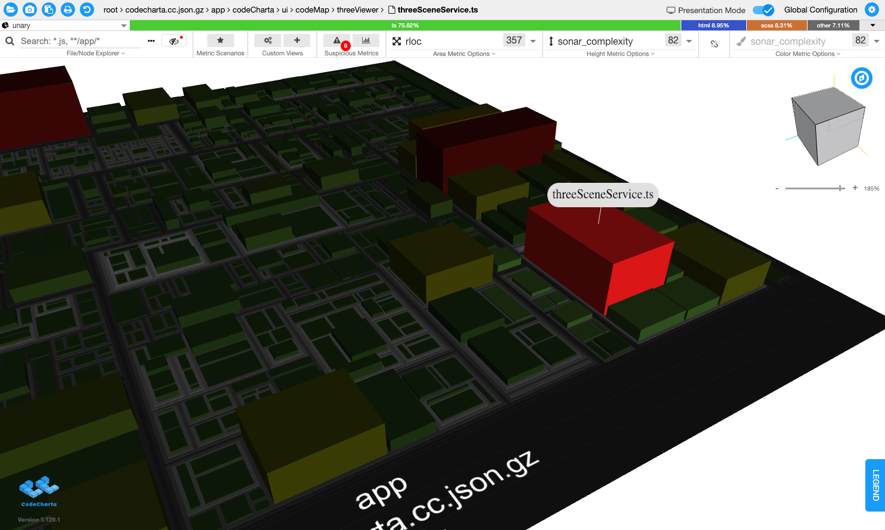
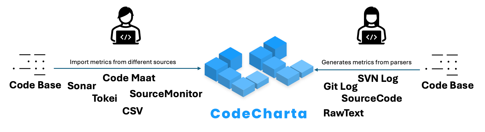
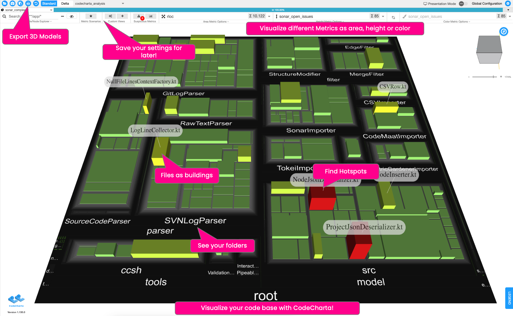
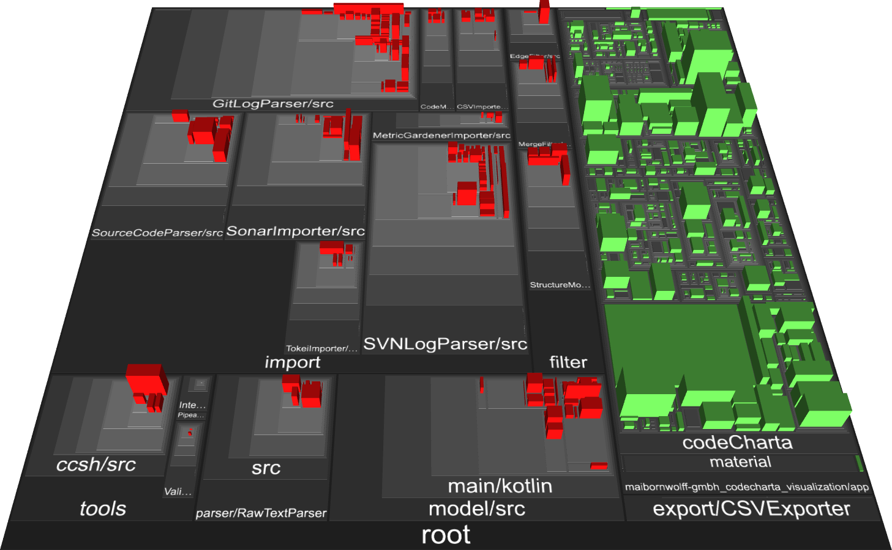

<div align="center">
  <a href="https://maibornwolff.github.io/codecharta/visualization/app/index.html?file=codecharta.cc.json.gz&file=codecharta_analysis.cc.json.gz&currentFilesAreSampleFiles=true">
    
  </a>

  <p>
    Latest Release: <br>
    Analysis <a href="https://github.com/MaibornWolff/codecharta/releases/tag/ana-1.130.0">1.130.0</a> | Visualization <a href="https://github.com/MaibornWolff/codecharta/releases/tag/vis-1.131.2">1.131.2</a>

[comment]: ##################################################################################
[comment]: <Ensure that the words 'latest release' are above the line with the links>
[comment]: ##################################################################################

  </p>

  <div>
    <a href="https://maibornwolff.github.io/codecharta/">Documentation</a> •
    <a href="#features">Features</a> •
    <a href="https://maibornwolff.github.io/codecharta/docs/overview/getting-started">Quickstart</a> •
    <a href="#get-involved">Get Involved</a> •
    <a href="#links">Links</a>
  </div>

  <div>
    <a href="https://github.com/MaibornWolff/codecharta/actions/workflows/release-analysis.yml">
      
    </a>
    <a href="https://github.com/MaibornWolff/codecharta/actions/workflows/release-visualization.yml">
      
    </a>
    <a href="https://sonarcloud.io/dashboard?id=maibornwolff-gmbh_codecharta_analysis">
      </a>
    <a href="https://sonarcloud.io/dashboard?id=maibornwolff-gmbh_codecharta_visualization">
      
    </a>
  </div>
</div>



## What is CodeCharta

Having trouble communicating the problems in your code base? Look no further, CodeCharta is able to visualise or even print your code base
in 3D! While showing you lots of different metrics to help you decide what to tackle next. Without sharing your code! CodeCharta is an open
source project mainly developed by [MaibornWolff](https://www.maibornwolff.de/en). You can find everything you need in
our [Documentation](https://maibornwolff.github.io/codecharta/).

## Features

### CodeCharta Shell (Analysis)

Our Shell is the heart of CodeCharta. It allows you to import metrics from various sources or parse your code base.
You need it to generate the data needed for our Web Studio. It supports different imports
from [Sonar](https://maibornwolff.github.io/codecharta/docs/importer/sonar),
[Tokei](https://maibornwolff.github.io/codecharta/docs/importer/tokei),
[Code Maat](https://maibornwolff.github.io/codecharta/docs/importer/code-maat),
[Source Monitor](https://maibornwolff.github.io/codecharta/docs/importer/sourcemonitor),
or even [CSV](https://maibornwolff.github.io/codecharta/docs/importer/csv) files! Or you can parse your code base directly with various
parsers for [Git Log](https://maibornwolff.github.io/codecharta/docs/parser/git-log),
[SVN Log](https://maibornwolff.github.io/codecharta/docs/parser/svn-log),
[Source Code](https://maibornwolff.github.io/codecharta/docs/parser/source-code),
and [Raw Text](https://maibornwolff.github.io/codecharta/docs/parser/raw-text).
> None of this will be uploaded or shared somewhere, everything happens on the client side. You can even run it locally if you want.



### [Web Studio](https://codecharta.com/visualization/app/index.html?file=codecharta.cc.json.gz&file=codecharta_analysis.cc.json.gz&area=rloc&height=sonar_complexity&color=sonar_complexity) (Visualisation)

Our [Web Studio](https://codecharta.com/visualization/app/index.html?file=codecharta.cc.json.gz&file=codecharta_analysis.cc.json.gz&area=rloc&height=sonar_complexity&color=sonar_complexity) allows you to visualize your code base in 3D. It takes the results from our Shell and displays them in a city-like map.
You can move around your code base, zoom in and out, and see the metrics of your code base in a 3D map.
Files with metrics become buildings where the area, height and color represent different metrics, you can freely choose!
Makes it easy to see the hotspots in your code base and find areas for improvement.
Ever wanted to touch that huge complex service? Download your map as a 3D model and print your code base!
Take it in your hands and show it to your colleagues.
> None of this will be uploaded or shared somewhere, everything happens on the client side. You can even run it locally if you want.



#### Track changes

Compare two maps and see the delta between them. This allows you to see the changes in your code base over time.



## Getting started

You can find our preferred way to get started
under [Documentation - Quick Start Guide](https://maibornwolff.github.io/codecharta/docs/overview/getting-started).

But if you already know what to do, here is how you install our CCSH.

```bash
# Install our codecharta shell globally
$ npm i -g codecharta-analysis
# Check if it is installed
$ ccsh - h
# done :)
```

## Get Involved

Do you have a **bug**, **feature request**, or question? Please open [a new issue](https://github.com/MaibornWolff/codecharta/issues/new).
Feedback is always welcome.

Want **more information**? Check out our [documentation](https://maibornwolff.github.io/codecharta/)
and [news](https://maibornwolff.github.io/codecharta/news/).

## Service Offerings

Your company needs professional support to analyse your code base? We offer a service to help you with that.

### Code Quality Insights

Get a report about your hotspots and areas for improvement. This is currently free of charge.

**Click** the link to learn
more: [Code Quality Insights](https://www.maibornwolff.de/en/code-quality-insights?utm_source=github_repo&utm_medium_website&utm_campaign=code_charta_at_github&utm_id=code_charta_at_github)

### Software Health Check

A full Software Health Check for your codebase and everything around it. **Click** the link to learn
more: [Software Health Check](https://www.maibornwolff.de/en/service/software-health-check/)

## Links

- [Documentation](https://maibornwolff.github.io/codecharta/)
- [Quickstart Guide](https://maibornwolff.github.io/codecharta/docs/overview/getting-started)
- [Releases](https://github.com/MaibornWolff/codecharta/releases)
- [Coverage](https://maibornwolff.github.io/codecharta/visualization/coverage/lcov-report/)
- [Analysis - Changelog](analysis/CHANGELOG.md) | [Visualization - Changelog](visualization/CHANGELOG.md)
- [Contributing](CONTRIBUTING.md)
- [Code of Conduct](CODE_OF_CONDUCT.md)
- [License](LICENSE.md)

## License

BSD-3-Clause License

---

Made with ❤ by [MaibornWolff](https://www.maibornwolff.de/en) &nbsp;&middot;&nbsp; GitHub [@MaibornWolff](https://github.com/maibornwolff)
