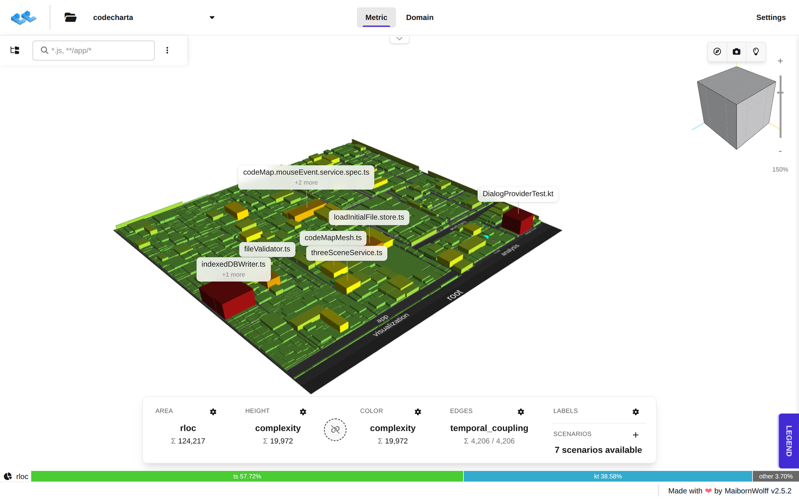
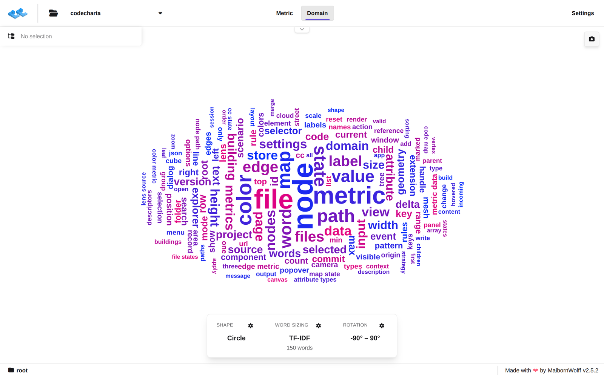
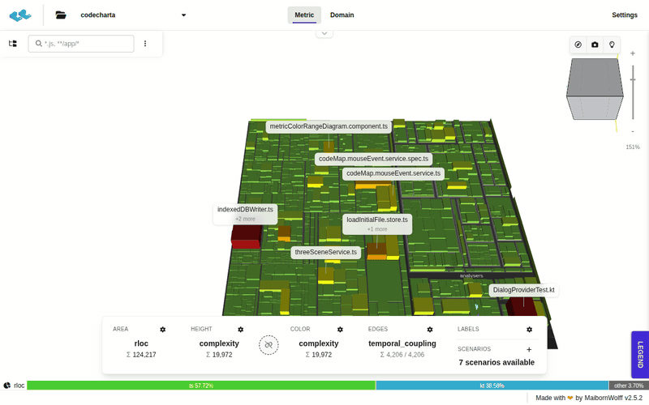
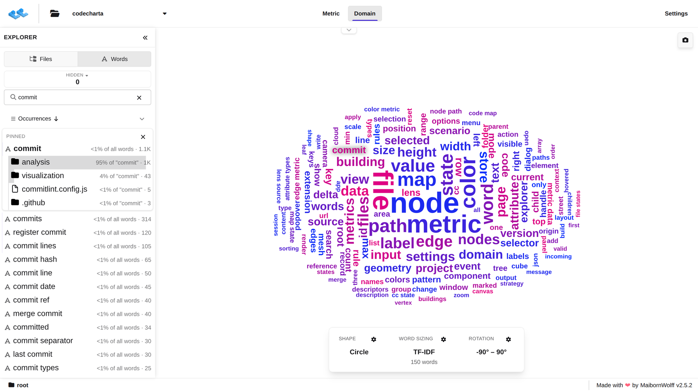
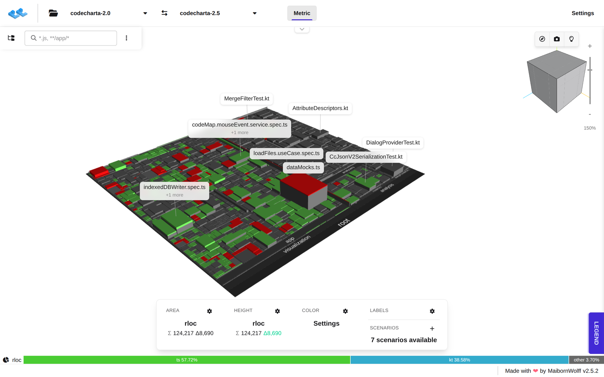

<div align="center">
  <a href="https://codecharta.com/visualization/app/index.html?file=codecharta_visualization.cc.json.gz&file=codecharta_analysis.cc.json.gz&currentFilesAreSampleFiles=true">
    
  </a>

  <h1>CodeCharta</h1>

  <h3>See how your code is built, and what it is about.</h3>

  <p>
    CodeCharta turns any codebase into a 3D city of metrics and a map of its domain language.<br>
    Spot hotspots in seconds. Show your team what you mean instead of explaining it.
  </p>

  <p>
    <a href="https://codecharta.com/visualization/app/index.html?file=codecharta_visualization.cc.json.gz&file=codecharta_analysis.cc.json.gz&currentFilesAreSampleFiles=true"><b>▶ Try the live demo</b></a> •
    <a href="https://codecharta.com/stg/visualization/index.html?file=codecharta_visualization.cc.json.gz&file=codecharta_analysis.cc.json.gz&area=rloc&height=functions&color=sonar_complexity&edge=avgCommits&currentFilesAreSampleFiles=true">Staging demo</a> •
    <a href="#quickstart">Quickstart</a> •
    <a href="https://maibornwolff.github.io/codecharta/">Documentation</a> •
    <a href="https://github.com/MaibornWolff/codecharta/releases">Releases</a>
  </p>

  <p>
    <a href="https://github.com/MaibornWolff/codecharta/releases/tag/ana-2.0.2">
      </a>
    <a href="https://github.com/MaibornWolff/codecharta/releases/tag/vis-2.6.0">
      </a>
    <a href="https://github.com/MaibornWolff/codecharta/tree/ana-2.0.2">
      </a>
    <a href="https://github.com/MaibornWolff/codecharta/tree/vis-2.6.0">
      </a>
    <br>
    <a href="https://sonarcloud.io/dashboard?id=maibornwolff-gmbh_codecharta_analysis">
      </a>
    <a href="https://sonarcloud.io/dashboard?id=maibornwolff-gmbh_codecharta_visualization">
      </a>
    <a href="LICENSE.md">
      </a>
    <br>
    <a href="https://codecharta.com/visualization/app/index.html?file=codecharta_visualization.cc.json.gz&file=codecharta_analysis.cc.json.gz&currentFilesAreSampleFiles=true">
      </a>
    <a href="https://codecharta.com/stg/visualization/index.html?file=codecharta_visualization.cc.json.gz&file=codecharta_analysis.cc.json.gz&area=rloc&height=functions&color=sonar_complexity&edge=avgCommits&currentFilesAreSampleFiles=true">
      </a>
  </p>
</div>

<p align="center">
  
  
</p>
<p align="center"><sub>CodeCharta analysing itself. <b>Left:</b> every building is a file, big and red means large and complex. <b>Right:</b> the words the code is written in.</sub></p>

## Two views of one codebase

### 🏙️ Metric view: find the hotspots

Every file is a building. You pick what **area**, **height** and **color** mean: lines of code, complexity,
number of commits, number of authors, function length and dozens more. The files that need your attention
stick out of the skyline.

- **Hotspots:** big + tall + red = large, complex and changed all the time
- **Knowledge silos:** color by number of authors to find code only one person understands
- **Temporal coupling:** edges connect files that always change together, even without an import
- **Filter and focus:** search, flatten or exclude files, including by rule like `complexity > 50`
- **Scenarios:** built-in and saved presets for complexity, code smells, authors and more
- **3D print:** export the city as a 3D model and put your codebase on the table

<p align="center">
  
</p>

### 🔤 Domain view: read what the code is about

The domain language parser reads identifiers, comments and strings, filters out keywords and technical noise, and
scores every word by frequency and **TF-IDF**. The result is the vocabulary of your business, not of your framework.

- **Word cloud per folder:** pick any file or folder and see the words it is written in
- **Where does a word live?** Open a word and get its breakdown over the file tree
- **Phrases, not just words:** bigrams like `commit hash` or `merge commit`
- **Jump between views:** from any node, *Show in Metrics* or *Show in Domain*

<p align="center">
  
</p>
<p align="center"><sub>Where does "commit" live? 95% in <code>analysis</code>, where the git log parser is.</sub></p>

### 📈 Delta view: see what changed

Load two versions and compare them. Green grew, red shrank, and you see where a release actually happened.

<p align="center">
  
</p>

## Quickstart

**1. Install the CodeCharta Shell** (Node ≥ 22.19 and Java 17 to 21)

```bash
npm i -g codecharta-analysis
```

**2. Analyse your project**

```bash
cd my-project
ccsh unifiedparser . -o metrics.cc.json.gz                   # size, complexity, functions
ccsh gitlogparser repo-scan --repo-path . -o git.cc.json.gz  # commits, authors, coupling
ccsh domainlanguageparser . --ngrams=2 -o domain.cc.json.gz  # domain words and phrases
ccsh merge metrics.cc.json.gz git.cc.json.gz domain.cc.json.gz -o my-project.cc.json.gz
```

Or let [`simplecc.sh`](analysis/script/simplecc.sh) run every analysis available on your machine and merge the
results for you. Not sure which command you need? `ccsh -i` asks you step by step.

**3. Open it** in the [Web Studio](https://codecharta.com/visualization/app/index.html): drag and drop the
file, done.

Prefer a desktop app or Docker? See [Getting started](https://maibornwolff.github.io/codecharta/docs/overview/getting-started).

## Your data stays local

All analysis and visualization run **entirely on your machine**. Nothing is uploaded, shared or sent anywhere.
There is no analytics, tracking or telemetry.

## What CodeCharta can read

| | |
| --- | --- |
| **Source code** | [Unified parser](https://maibornwolff.github.io/codecharta/docs/parser/unified): Java, Kotlin, TypeScript, JavaScript, Python, C#, C, C++, Go, Rust, PHP, Ruby, Swift, Objective-C, Vue, Bash, Delphi |
| **Domain language** | [Domain language parser](https://maibornwolff.github.io/codecharta/docs/parser/domain-language): words and phrases with frequency and TF-IDF |
| **Version control** | [Git log](https://maibornwolff.github.io/codecharta/docs/parser/git-log), [SVN log](https://maibornwolff.github.io/codecharta/docs/parser/svn-log) |
| **Any text** | [Raw text](https://maibornwolff.github.io/codecharta/docs/parser/raw-text): indentation levels for any language |
| **Your other tools** | [SonarQube](https://maibornwolff.github.io/codecharta/docs/importer/sonar), [Coverage](https://maibornwolff.github.io/codecharta/docs/importer/coverage), [DependaCharta](https://maibornwolff.github.io/codecharta/docs/importer/dependacharta), [Tokei](https://maibornwolff.github.io/codecharta/docs/importer/tokei), [Code Maat](https://maibornwolff.github.io/codecharta/docs/importer/code-maat), [SourceMonitor](https://maibornwolff.github.io/codecharta/docs/importer/sourcemonitor), [CSV](https://maibornwolff.github.io/codecharta/docs/importer/csv) |

[Merge](https://maibornwolff.github.io/codecharta/docs/filter/merge-filter) any combination into one map,
[reshape](https://maibornwolff.github.io/codecharta/docs/filter/structure-modifier) its folder tree, or
[export it to CSV](https://maibornwolff.github.io/codecharta/docs/exporter/csv).

## Get Involved

Do you have a **bug**, **feature request**, or question? Please open [a new issue](https://github.com/MaibornWolff/codecharta/issues/new).
Feedback is always welcome.

Want **more information**? Check out our [documentation](https://maibornwolff.github.io/codecharta/)
and [release notes](https://github.com/MaibornWolff/codecharta/releases).

## Service Offerings

Your company needs professional support to analyse your code base? We offer a service to help you with that.

### Software Health Check

A full Software Health Check for your codebase and everything around it. **Click** the link to learn
more: [Software Health Check](https://www.maibornwolff.de/en/software-health-check/)

## Links

- [Documentation](https://maibornwolff.github.io/codecharta/)
- [Quickstart Guide](https://maibornwolff.github.io/codecharta/docs/overview/getting-started)
- [Releases](https://github.com/MaibornWolff/codecharta/releases)
- [Coverage](https://maibornwolff.github.io/codecharta/visualization/coverage/lcov-report/)
- [Analysis - Changelog](analysis/CHANGELOG.md) | [Visualization - Changelog](visualization/CHANGELOG.md)
- [Contributing](dev_docs/CONTRIBUTING.md)
- [Code of Conduct](dev_docs/CODE_OF_CONDUCT.md)
- [Dev Start Guide](dev_docs/DEV_START_GUIDE.md)
- [License](LICENSE.md)

## License

BSD-3-Clause License

---

Made with ❤ by [MaibornWolff](https://www.maibornwolff.de/en) &nbsp;&middot;&nbsp; GitHub [@MaibornWolff](https://github.com/maibornwolff)
