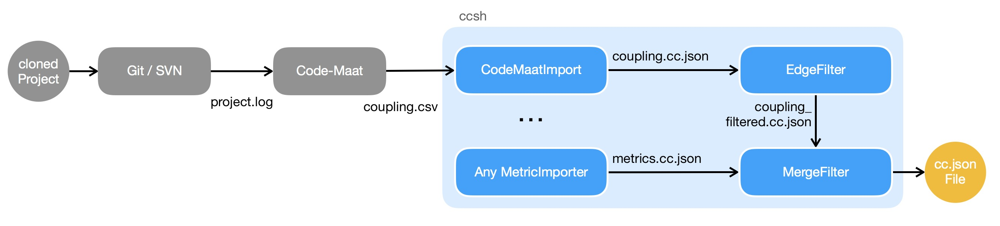

# CodeMaatImporter

Generates visualisation data from CodeMaat Temporal Coupling CSV data with header. You can find the analizing tool on GitHub https://github.com/adamtornhill/code-maat

## Usage

1. Create VCS Log file from your project, e.x. with Git

    `git log --pretty=format:'[%h] %an %ad %s' --since=<YYYY/MM/DD> --date=short --numstat > project.log`

2. Analyse the Log with [CodeMaat](https://github.com/adamtornhill/code-maat)

    `maat -c git -l project.log -a coupling > coupling.csv`

3. Convert csv file to cc.json format with CodeMaatImporter

    `ccsh codemaatimport coupling.csv -o coupling.cc.json`
        
4. Merge the coupling data with the project metrics file while using the [MergeFilter](https://github.com/MaibornWolff/codecharta/blob/master/analysis/filter/MergeFilter/README.md)

    `ccsh merge coupling.cc.json metrics.cc.json -o merged.cc.json`
    
5. Visualizing `merged.cc.json` with [Visualization](https://github.com/MaibornWolff/codecharta/tree/master/visualization)




## Example File Content

```
$ cat project.log
[a9829640] Max Mustermann 2018-06-05 Set new logo
  1    1    app/codeCharta.scss
[fc14b1e2] Max Mustermann 2018-06-05 Update cc-label position
  4    2    app/codeCharta.html
  25   15   app/codeCharta.scss
  4    2    app/testVille.html
...
```

```
$ cat coupling.csv
entity,coupled,degree,average-revs
app/codeCharta.html, app/codeCharta.scss, 56, 10
app/testVille.html, app/codeCharta.html, 42, 8
...
```

```
$ cat coupling.cc.json
{
  "projectName": "Sample Project with edges",
  "apiVersion": "1.1",
  "nodes": [
    {
      "name": "root",
      "type": "Folder",
      "attributes": {},
      "children": []
        }
      ]
    }
  ],
  "edges": [
      {
        "fromNodeName": "/root/app/codeCharta.html",
        "toNodeName": "/root/app/codeCharta.scss",
        "attributes": {
          "pairingRate": 56,
          "avgCommits": 10
        }
      },
      {
        "fromNodeName": "/root/app/testVille.html",
        "toNodeName": "/root/app/codeCharta.html",
        "attributes": {
          "pairingRate": 42,
          "avgCommits": 8
        }
      }
    ]
}
```
