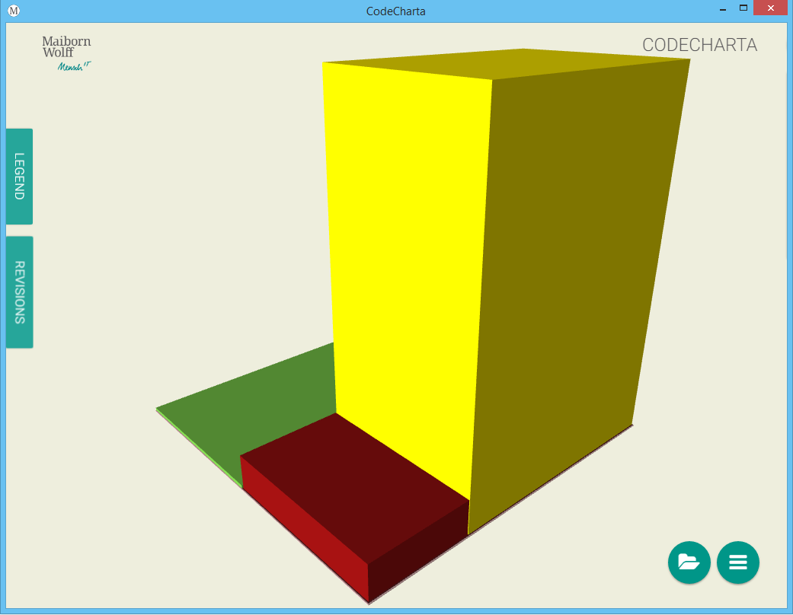
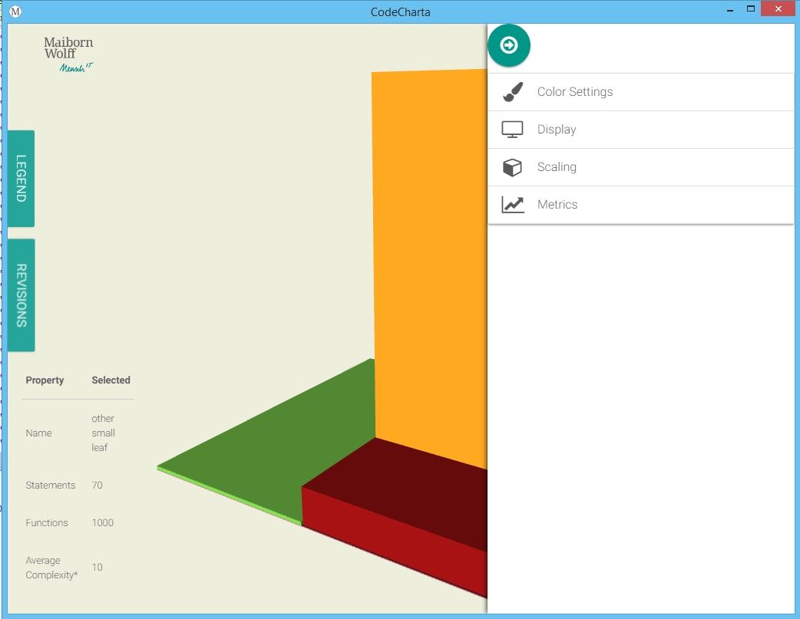

# Quicklinks

[Visualization Demo](visualization/app/index.html?file=codecharta.cc.json)

[Downloads](https://github.com/MaibornWolff/codecharta/releases)

# What is CodeCharta ?

CodeCharta visualizes multiple code metrics using 3D tree maps. It consists of two parts:

visualization: GUI for visualising data
analysis: Tools for generating visualisation data

# Quickstart

## Install application for desktop usage with npm

* install visualization with `npm install @maibornwolff/codecharta-visualization -g`
* install analysis with `npm install @maibornwolff/codecharta-analysis -g`
* run visualization with `codecharta-visualization`
* run analysis with `ccsh`

## How to install CodeCharta from github

- Download the [latest release](https://github.com/MaibornWolff/codecharta/releases/latest) of CodeCharta (codecharta-analysis and codecharta-visualization)
- you should now have the analysis and visualization package 
- unpack both packages
- enter the codecharta-analysis directory with your favorite console

**linux only:** make extracted ccsh runnable (`chmod u+x ccsh`)

- > ./ccsh install
- > ./ccsh -h

## run local sonar analysis with a docker container (Mac)
- `brew install sonar-scanner`
- `docker run -d --name sonarqube -p 9000:9000 -p 9092:9092 sonarqube`
- add a correct sonar-project.properties file to the target project
- run `sonar-scanner` in the projects folder
- you can now access your sonarqube instance and analysis on localhost:9000

## Analyze a sonarqube project

Choose a sonar analysed project of your choice and enter the file, url and project-id. If necessary, generate a User Token in the sonar remote instance and include it in the following command:
  - >./ccsh sonarimport [options] [[file]|[url] [project-id]]

```markdown
Options:
-m, --metrics
      Comma-separated list of metrics to import (defaults to all)
-o, --outputFile
      Output File (or empty for stdout)
-u, --user
      User Token for connecting to remote sonar instance
```

CodeCharta may ask for a user authentification, depending on the configuration of the projects SonarQube server. Log in to your server, navigate to the project and create a user token. This string can be easily added as seen in the command description above.  
If you don't have any own projects yet, you can test CodeCharta with any opensource project you can find on the sonarqube website.

The easiest example:
  - >./ccsh sonarimport [sonar-server-url] [project-id]
 
An output file has been created.

## Visualize the analyzed project

Open the visualization directory and run the executable
A new window should open now. 


- In the right lower corner, click on the folder icon. 
- Choose the generated .json file from the previous step

Now you can see the analysis of the chosen project visualized in coloured blocks. 

Navigation:
- left click and drag -> rotate 
- right click and drag -> move the blocks
- mousewheel -> zoom in and out
Tip: If your device has a touch display, you can quickly navigate with your fingers. Use multiple fingers to drag and move the blocks. 

Change the visualized content:
- click on the second button for the settings


**Metrics:**

You can choose up to 3 metrics at once to be visualized. One defines the color of each block, one the height and one the area.
Each metric has an own value range, for Example the metric "lines of code" is the exact amount of lines in the file, that is visualized in one block. Some other metrics, like "coverage" use percantages. 

**Scaling:**

If your map is too flat to compare the blocks, or too high to even fit the window, you can scale each axis with the slider.

**Display:**

If you want to compare multiple versions of a project, use "Delta cubes". A red or green block is added on top of those blocks, that changed. This allowes you to observe changes.

**Color Settings:**

Depending on the visualized color-giving metric, you may have different accaptance values. Blocks are either coloured red, green or yellow, which is the neutral color. 
Example: Your color-metric is test-coverage, which has a range from 0 to 100 and is a percantage. 
If you want to colorize everything that has values under 20% red, and higher then 70% green, set "Neutral color start" to 20 and "Neutral color end" to 70. 
Use the "Invert Color" option, to declare a high value to be better then a low value. (A low test-coverage should be red, a low complexity should be green)

# Demo

[Browser Demo](visualization/app/)

# Further information

## Guides

[Integrating CodeCharte into a Jenkins 2 and Sonarqube pipeline](ci.md)

## URL Parameters used by the web application

The web application allows the usage of query parameters in the URL to set 
certain settings. Query params are added by appending a `?` to the url, 
followed by a key value pair `key=value`. Additional parameters can be 
added by appending `&key2=value2`. E.g. `http://yourdomain.com/pathtocc/index.html?file=something.json&scaling.x=2&areaMetric=myMetric`

* The `file` parameter is a special parameter which accepts a file location. The file must be reachable through XHR.
* All other parameters are defined by the [Settings interface](/visualization/app/codeCharta/core/settings/settings.service.ts). 
`areaMetric=myMetric` therefore sets the value of settings.areaMetric to `myMetric`. Nested properties like `settings.scale.x` can be 
set by the query parameter `scaling.x=42`
* The `map` parameter is disabled since it would be too much for the URL bar of your browser.
* The URL in your browser gets automatically updated when you change settings through the UI. 
It provides a simple way to customize your links with query parameters.

## Visualization

[Readme](https://github.com/MaibornWolff/codecharta/tree/master/visualization)

[Browser Demo](visualization/app/index.html?file=codecharta.cc.json)

[Coverage](visualization/coverage/lcov-report)

[Sonarqube Analysis](https://sonarcloud.io/dashboard?id=de.maibornwolff.codecharta%3Avisualization)

[Reference](visualization/docs/)

## Analysis

[Readme](https://github.com/MaibornWolff/codecharta/tree/master/analysis)

[Sonarqube Analysis](https://sonarcloud.io/dashboard?id=de.maibornwolff.codecharta%3Aanalysis)

# Contributing

[Contributing](https://github.com/MaibornWolff/codecharta/blob/master/CONTRIBUTE.md)

[Code of Conduct](https://github.com/MaibornWolff/codecharta/blob/master/CODE_OF_CONDUCT.md)

# Releases and Changelog

[Releases](https://github.com/MaibornWolff/codecharta/releases)

[Changelog](https://github.com/MaibornWolff/codecharta/blob/master/CHANGELOG.md)
