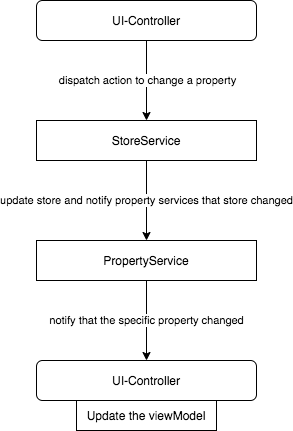
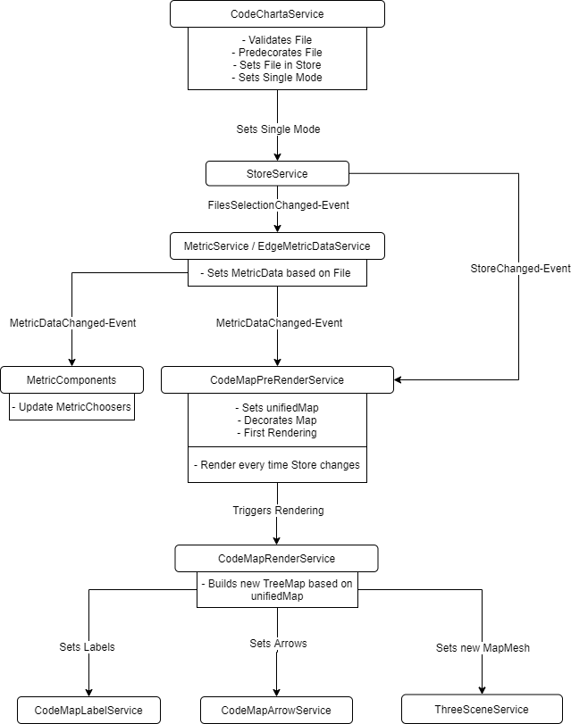

# New to Visualization

The visualization opens a cc.json and displays a city-like landscape based on the folder structure.

### State Management

We use Redux to manage our state. This way we have a single state that allows us to have a single one-directional data flow at a time. Get familiar with the [core-concepts of redux](https://redux.js.org/introduction/core-concepts) and check out the chart below afterwards.

This chart shows the correct way to update the viewModel of a controller.

This chart shows the data flow in our architecture when a new cc.json is opened.

### Architecture boundaries

The code under `app/codeCharta/` is organised into modules whose boundaries are enforced by
**dependency-cruiser** (`npm run lint:architecture`, config in `.dependency-cruiser.js`):

- `features/*` — feature slices reached only through their `facade.ts` or `components/`; `@ngrx/store`
  is touched only from a feature's `stores/`/`selectors/`.
- `fileStore/` — the source of truth: the files state slice plus the cc.json load pipeline
  (`loaders/ccJson`, the only place the cc.json wire DTO `codeCharta.api.model` may be imported).
- `lenses/*` — data modules that overlay the file tree. A lens is reached **only** through its public
  surface: the lens facade (`lenses/<lens>/<lens>.facade.ts`) for data, or a feature's `components/` to
  mount a panel. Internally a lens is `components → services → repos → store`. The first lens is
  `lenses/metrics`, which **owns** the node-metric domain: `nodeMetricData.calculator`, the
  color-range selector, and the node-side attribute maps all live under `lenses/metrics/store`. The
  legacy `metricDataSelector` is now a shrinking aggregator that reads the lens's node selector via the
  facade and keeps composing the (still-legacy) edge side for the future dependency lens. The lens also
  hosts the Legend.
- `model/` + `util/` — the shared kernel both worlds import (e.g. `util/metric/sortByMetricName`, shared by
  the node and edge calculators, and `util/metric/unaryMetric`, shared by the node calculator and the
  decoration/export kernel).

These boundaries are the first slices of the **Visualization 2.0** migration toward a
lenses × renderers architecture; see `Ideas/codecharta-2.0-implementation-map.html` for the target map.

### Other Technologies

- Typescript
- npm
- Angular
- Jest (Unit Tests)
- Puppeteer (E2E Tests)
- ThreeJs for 3d visualization
- d3 for tree map algorithm and tree hierarchy (parent-child relations)
- Webpack
- electron
- Redux

### Important Concepts

- Dependency Injection
- Observer Pattern (`.subscribe(...)`)
- 2D Squarified TreeMap

### Building

There are 3 possible ways to build and run the application. You can run it as a developer with hot-code, which allows you to make changes in the code and see the results in your browser a few seconds later. But you can also build the application yourself and run it in a standalone or in the browser.

> Note that the `build` command requires unix tools on path, so on Windows add them to it or use the bash shell

- Development: `npm run dev`
- Standalone: `npm run build` -> `npm start`
- Web: `npm run build` -> Move the created content to a nginx server for example

### Testing

- Unit-Tests: `npm test`
- E2E-Tests: `npm run build && npm run e2e`
- For IntelliJ: Run -> Edit Configurations -> Templates -> Jest -> Add configuration file -> Select `jest.config.json` -> Add CLI argument `--env=jsdom`

For more test options check the `package.json`

<!-- ### Troubleshooting -->
